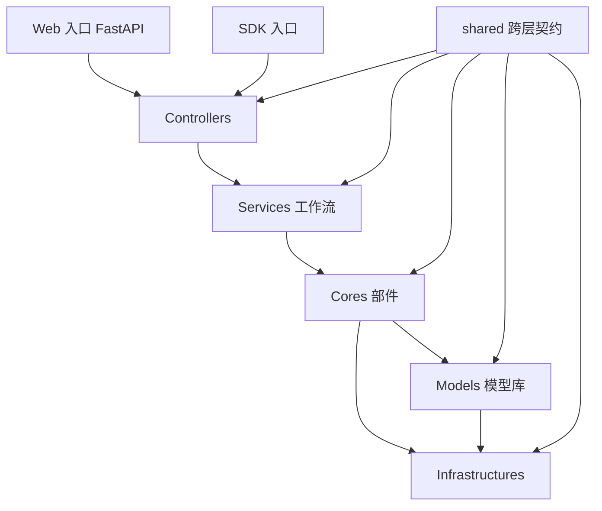
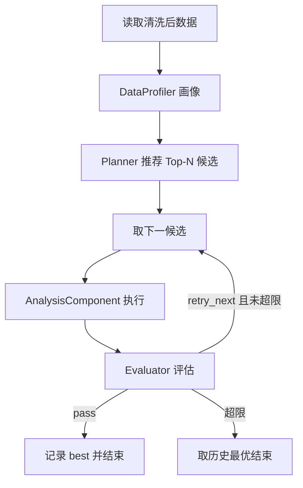

# 通用数据分析工具 — 后端分层架构详细设计文档

> 版本：v1.0
> 状态：设计稿（未实现）
> 目标：将现有混乱的后端重构为 Interfaces / Services / Cores / Models / Infrastructures 五层架构，支持 Agent 自动评估分析方法的插拔，并保持现有前端 API 契约兼容。

---

## 1. 总体架构

### 1.1 分层职责

| 层 | 职责 | 禁止事项 |
|---|---|---|
| Interfaces | 最外层入口。含控制器（会话/步骤控制）与 Web、SDK 两种接入方式；负责请求解析、参数校验、响应封装 | 不写业务逻辑，不直接访问存储 |
| Services | 工作流组装层。把前端选定的部件组装成工作流并驱动执行 | 不实现算法，不直接读写文件 |
| Cores | 数据分析执行层。各功能部件（导入/清洗/分析/可视化/报表）与 Agent 部件的具体执行 | 不 import fastapi，不感知请求来源 |
| Models | 基础模型库。机器学习模型注册表、工厂、封装类 | 不含业务流程逻辑 |
| Infrastructures | 支撑层。存储、读取器、序列化、配置、日志、LLM 网关 | 不依赖任何上层 |

### 1.2 依赖方向（单向）



### 1.3 目录结构

```
backend/
├── Interfaces/
│   ├── controllers/
│   │   ├── session_controller.py
│   │   └── step_controller.py
│   ├── web/
│   │   ├── app.py                  # FastAPI 装配
│   │   ├── routers/                # 11 个业务域 router
│   │   └── schemas/                # Pydantic 请求 DTO
│   └── sdk/
│       └── client.py               # DataAnalysisClient 门面
├── Services/
│   └── workflows/
│       ├── context.py              # WorkflowContext + StepStateMachine
│       ├── builder.py              # WorkflowBuilder
│       ├── manual_workflow.py
│       └── agent_workflow.py
├── Cores/
│   ├── base_component.py           # 部件统一协议
│   ├── components/
│   │   ├── import_component.py
│   │   ├── preview_component.py
│   │   ├── cleaning_component.py
│   │   ├── analysis_component.py
│   │   ├── visualization_component.py
│   │   └── reporting_component.py
│   └── agent/
│       ├── profiler.py             # DataProfiler
│       ├── planner.py              # AnalysisPlanner 接口 + Rule/LLM 实现
│       └── evaluator.py            # MethodEvaluator 接口 + Metric/LLM 实现
├── Models/
│   ├── registry.py                 # ModelRegistry
│   ├── factory.py                  # ModelFactory
│   └── wrappers/
│       ├── regression.py
│       ├── classification.py
│       ├── clustering.py
│       ├── reduction.py
│       └── association.py
├── Infrastructures/
│   ├── storage/
│   │   ├── temp_storage.py
│   │   ├── model_store.py
│   │   └── report_store.py
│   ├── importers/
│   │   ├── file_importer.py        # csv/excel/json/html
│   │   └── db_importer.py
│   ├── serialization.py
│   ├── llm_gateway/
│   │   ├── base.py
│   │   └── mock.py
│   ├── config/
│   │   └── config_manager.py
│   └── logging/
│       └── log_setting.py
└── shared/
    └── types.py                    # 跨层数据契约与领域异常
```

---

## 2. shared 层设计（跨层契约）

`shared/types.py` 定义所有跨层传递的数据结构与异常，任何层不得在层间传递未在此定义的结构。

### 2.1 枚举

| 枚举 | 取值 | 说明 |
|---|---|---|
| StepName | import / preview / cleaning / analysis / visualization / report | 流程步骤，顺序固定 |
| TaskType | regression / classification / clustering / dimensionality_reduction / association / unknown | 分析任务类型 |
| CleanMode | auto / manual / freedom | 清洗模式 |
| ReportType | full / summary / technical / executive | 报告模板类型 |
| WorkflowMode | manual / agent | 工作流模式 |
| DecisionStatus | pass / fail / retry_next | Agent 评估结论 |

### 2.2 Artifact 体系（部件产物基类）

```python
@dataclass
class Artifact:
    step: StepName              # 产出该产物的步骤
    created_at: datetime
    storage_key: Optional[str]  # temp_storage 中的键，支持断点续跑

class ImportedArtifact(Artifact): shape, columns, dtypes, source
class PreviewArtifact(Artifact):  head_records, dataset_info
class CleanedArtifact(Artifact):  shape, columns, target_col, clean_summary
class AnalysisArtifact(Artifact): task_type, model_type, model_params,
                                  metrics, predictions, trained_model_ref
class VisualizationArtifact(Artifact): charts: Dict[name, plotly_json]
class ReportArtifact(Artifact):   report_id, content, file_path
```

规则：
- Artifact 中不得直接携带大 DataFrame；DataFrame 一律落 `temp_storage`，Artifact 只持 `storage_key` 与元信息
- `trained_model_ref` 为模型存储键，不携带模型实例（序列化安全）

### 2.3 Agent 契约

```python
@dataclass
class DataProfile:
    n_rows: int
    n_cols: int
    columns: List[ColumnProfile]      # 每列：名称/类型/缺失率/唯一值数/基数
    target_col: Optional[str]
    inferred_task_type: TaskType      # 由画像规则推断
    memory_mb: float

@dataclass
class PlanCandidate:
    model_type: str                   # Models 注册表中的 key
    task_type: TaskType
    suggested_params: Dict[str, Any]
    priority: int                     # 越小越优先
    reason: str                       # 推荐理由（规则文案或 LLM 输出）

@dataclass
class EvaluationReport:
    status: DecisionStatus
    score: Optional[float]            # 归一化 0-1 综合评分
    metrics_evaluated: Dict[str, float]
    suggestion: str                   # 文字建议
    next_action: str                  # keep / retry_next / abort

@dataclass
class AgentDecision:
    session_id: str
    profile: DataProfile
    attempts: List[AttemptRecord]     # 每次尝试：model_type/metrics/evaluation
    best: Optional[AttemptRecord]
    finished_at: datetime
```

### 2.4 领域异常

| 异常 | 抛出层 | HTTP 映射 |
|---|---|---|
| SessionNotFound | Controllers | 404 |
| SessionTimeout | Controllers | 410 |
| StepLocked | StepController | 423 |
| WorkflowOrderError（步骤顺序非法） | Services | 400 |
| InvalidModelParams | Models | 400 |
| ComponentExecutionError | Cores | 500 |
| ImportError_（数据读取失败） | Infrastructures | 400 |

---

## 3. Infrastructures 层设计

### 3.1 storage/temp_storage.py — TempStorage

由现 `TempStorage` 迁入，接口收敛为：

| 方法 | 说明 |
|---|---|
| `save_dataframe(df, session_id, stage)` | 按会话+阶段落 pkl |
| `load_dataframe(session_id, stage) -> Optional[DataFrame]` | 读取 |
| `save_artifact(session_id, artifact)` / `load_artifact(...)` | 产物持久化（断点续跑） |
| `clear_stage(session_id, stage)` | 清理单阶段 |
| `clear_session(session_id)` | 清理会话全部 |
| `clear_all()` | 启动时全清 |

目录布局：`TempStorage/{session_id}/{stage}.pkl`。

### 3.2 storage/model_store.py — ModelStore

承接现 `api/model_extractor.py` 的文件操作职责：

| 方法 | 说明 |
|---|---|
| `save_model(model, name, auto_dir=True)` | 保存到 ModelOutput/自动保存 |
| `list_models() -> List[ModelInfo]` | 列表（名称/大小/时间） |
| `transfer_model(name, target_dir)` | 转移到指定目录 |
| `manage(max_models)` | 超限清理最旧模型 |

### 3.3 storage/report_store.py — ReportStore（新增）

| 方法 | 说明 |
|---|---|
| `save_report(report_id, content, fmt)` | 落盘 ReportOutput/{report_id}.html |
| `load_report(report_id) -> bytes` | 供导出端点返回 |
| `list_reports(session_id)` | 报告列表 |

### 3.4 importers/

| 类 | 职责 |
|---|---|
| FileImporter | 按扩展名分发 csv/excel/json/html 读取；支持 chunksize 流式读取 |
| DbImporter | 按连接串读取数据库表或 SQL 查询（sqlite/mysql 首版） |

统一签名：`read(source, **kwargs) -> DataFrame`，异常统一抛 `ImportError_`。

### 3.5 serialization.py — Serializer（修复 np 未导入 Bug）

单一入口 `make_serializable(data)`：

- `DataFrame` → `to_dict(orient='records')`
- `Series` → `to_list()`
- `ndarray` → `tolist()`
- numpy 标量 → `.item()`
- 模型实例/sklearn 对象 → 剔除或转类名
- `NaN/Inf` → None
- dict/list 递归处理

### 3.6 llm_gateway/

```python
class LLMGateway(Protocol):
    def chat_json(self, prompt: str, schema_hint: dict) -> dict
class MockLLM(LLMGateway): ...   # 返回规则化兜底 JSON，保证无 LLM 环境可运行
```

配置项（config/llm_config.json）：`provider / api_key / model / timeout / enabled`。`enabled=false` 时 Agents 层强制使用规则实现。

### 3.7 config/ 与 logging/

整体迁入现 `backend/Infrastructures/Configs`（config_manager、model_config.json、model_mapping_config.json、log_setting 等），接口不变，仅路径迁移。

---

## 4. Models 层设计

### 4.1 ModelRegistry

数据源：`model_config.json` + `model_mapping_config.json`。

| 方法 | 说明 |
|---|---|
| `list_task_types() -> List[str]` | 回归/分类/聚类/降维/关联 |
| `list_models(task_type=None) -> List[str]` | 模型 key 列表（对应前端 available-models） |
| `get_meta(model_type) -> ModelMeta` | class / type / init_params / default_params |
| `get_full_config() -> dict` | 对应前端 model-config 端点 |

### 4.2 ModelFactory

| 方法 | 说明 |
|---|---|
| `create(model_type, params=None) -> Estimator` | 合并默认参数后实例化 sklearn 模型 |
| `validate_params(model_type, params)` | 非法参数抛 InvalidModelParams |

### 4.3 wrappers/

按任务分包的薄封装，职责：sklearn 导入收敛、参数规整、训练异常归一为 `ComponentExecutionError`。现有 `backend/Models/analysis` 与 `AnalysisUpgrade` 中的模型逻辑迁入对应分包，统一由 factory 调度。

### 4.4 参数治理机制（四层）

每种机器学习模型都具有大量自由参数，采用四层机制治理：

1. **注册表白名单收敛暴露面**：前端 `model-config` 端点只返回白名单参数，据此动态生成表单；新增模型只改配置不动代码
2. **默认值全覆盖 + 局部覆盖合并**：`create()` 采用 `defaults | user_params` 合并策略，用户只传想改的少数关键参数，其余走默认值
3. **白名单校验拦截非法参数**：`validate_params` 三道检查——不在白名单则丢弃或报 `InvalidModelParams`；类型不符拒绝；值域非法拒绝
4. **Agent 自动调参（免手填）**：`PlanCandidate.suggested_params` 按数据画像推荐参数；预留 `ParamTuner` 扩展点（`Cores/agent/`，GridSearch/RandomSearch/Optuna 封装），AgentWorkflow 选定方法后自动搜索最优参数再评估

### 4.5 参数注册规范（交集 + 并集 + 白名单）

注册要求：模型参数按 sklearn `get_params()` **全量登记（并集）**，跨模型共有参数**抽取统一登记（交集）**，暴露集合独立引用（白名单）。

```
全局交集参数 common_params（所有/多数模型共有，注册一次）
        ∩
模型并集参数 params（每个模型的 sklearn 全量参数，逐一登记）
        →
暴露白名单 exposed（前端可见子集，引用前两者）
```

**1. 交集参数（common_params.json，全局唯一来源）**

```json
{
  "random_state": {"type": "int", "default": 42, "desc": "随机种子"},
  "n_jobs":       {"type": "int", "default": null, "desc": "并行数"}
}
```

- 各模型的 params 不再重复登记这些参数，工厂实例化时自动合并注入
- 判定标准：参数名与语义在 ≥80% 模型中一致才算交集；同名不同义（如不同模型的 `C`）不算，留在并集里

**2. 并集参数（模型条目结构）**

```json
"rf": {
  "class": "RandomForestClassifier",
  "task_type": ["classification", "regression"],
  "common": ["random_state", "n_jobs"],
  "params": {
    "n_estimators":      {"type": "int",      "default": 100,  "range": [1, 2000]},
    "max_depth":         {"type": "int|None", "default": null, "range": [1, 100]},
    "min_samples_split": {"type": "int",      "default": 2,    "range": [2, 100]},
    "criterion":         {"type": "enum",     "default": "gini", "options": ["gini", "entropy"]},
    "bootstrap":         {"type": "bool",     "default": true}
  },
  "exposed": ["n_estimators", "max_depth", "min_samples_split"]
}
```

**3. 工厂合并顺序（ModelFactory.create）**

```
最终参数 = common_params 默认值 → 模型 params 默认值 → Planner 推荐值 → 用户覆盖值
```

后者覆盖前者；遗漏未登记的参数用 sklearn 自身默认值兜底。

**4. 注册规则**

| 规则 | 说明 |
|---|---|
| 全量登记 | params 必须是 sklearn `get_params()` 的完整并集，禁止遗漏 |
| 交集唯一 | 交集参数只在全局文件定义一次，模型条目用 `"common": [...]` 引用 |
| 类型枚举 | type 限定为 int / float / bool / str / enum / int\|None / float\|None |
| 值域必填 | 数值型必须带 range，枚举必须带 options，供校验与 Agent 搜索空间使用 |
| 白名单分离 | exposed 独立于登记，调整前端展示不改参数定义 |

消费方：前端动态表单（读 exposed + 元数据）、校验器（读 type/range/options）、Agent Tuner（range/options 直接作为搜索空间）。

---

## 5. Cores 层设计

### 5.1 部件统一协议

```python
class BaseComponent(ABC):
    name: str                              # 对应 StepName
    required_inputs: List[StepName]        # 前置产物依赖

    @abstractmethod
    def execute(self, context, params: dict) -> Artifact
```

执行前置检查由 Services 依据 `required_inputs` 完成；部件内部不再各自校验步骤顺序。

### 5.2 各部件设计

| 部件 | 输入参数 params | 前置依赖 | 输出 |
|---|---|---|---|
| ImportComponent | resource_path, resource_type, is_database, db_connection_string, query, chunksize | 无 | ImportedArtifact |
| PreviewComponent | head_n（默认 10） | import | PreviewArtifact |
| CleaningComponent | select_mode, params_list, is_freedom_params, target_col | import | CleanedArtifact |
| AnalysisComponent | model_type, random_state, is_split, split_ratio, feature_cols, target_col, metrics_list, model_params, encoding 等（与现 run-analysis 参数一一对应） | cleaning（无清洗时回落 import） | AnalysisArtifact |
| VisualizationComponent | param_dict（可选，缺省按分析结果自动构建） | analysis | VisualizationArtifact |
| ReportingComponent | report_type | analysis + visualization | ReportArtifact |

AnalysisComponent 内部：`ModelFactory.create()` 取实例 → 训练/预测 → 计算指标 → 模型经 ModelStore 落盘 → 产出 AnalysisArtifact。现有 `DataAnalyzer.analyze()` 逻辑整体迁入。

### 5.3 agent/ 子层

```python
class DataProfiler:
    def profile(self, df, target_col=None) -> DataProfile
    # 规则：全数值+有目标列→回归/分类；无目标列→聚类；高维→建议降维

class AnalysisPlanner(Protocol):
    def recommend(self, profile: DataProfile) -> List[PlanCandidate]

class RulePlanner(AnalysisPlanner):
    # 内置规则表：任务类型×数据规模×特征类型 → 候选模型（候选集来自 ModelRegistry）

class LLMPlanner(AnalysisPlanner):
    # profile 序列化为 prompt → llm_gateway.chat_json → 解析为 PlanCandidate 列表

class MethodEvaluator(Protocol):
    def evaluate(self, profile, artifact: AnalysisArtifact) -> EvaluationReport

class MetricEvaluator(MethodEvaluator):
    # 阈值表：R2>=0.7 / accuracy>=0.8 / f1>=0.75 / silhouette>=0.4 → pass

class LLMEvaluator(MethodEvaluator):
    # 指标摘要+任务背景 → LLM 语义评估
```

Agent 部件只读 Artifact 与 ModelRegistry，不修改任何状态；插入点完全在 Services 工作流中。

---

## 6. Services 层设计

### 6.1 WorkflowContext 与 StepStateMachine

```python
class StepStateMachine:
    ORDER = [import, preview, cleaning, analysis, visualization, report]
    def complete(step) / reset_from(step) / status() -> StepStatus
    def lock(step) / unlock(step)          # 唯一锁状态来源（消除双轨）

class WorkflowContext:
    session_id: str
    steps: StepStateMachine
    artifacts: Dict[StepName, Artifact]
    created_at / last_accessed: float
```

级联重置语义与现 `reset_step_and_following` 一致：重置某步骤时解锁并清空其后所有步骤的 Artifact 与 temp_storage 数据。

### 6.2 WorkflowBuilder

```python
class WorkflowBuilder:
    def build(self, mode: WorkflowMode) -> ManualWorkflow | AgentWorkflow
```

### 6.3 ManualWorkflow

```python
class ManualWorkflow:
    def execute_step(self, context, step: StepName, params: dict) -> Artifact
    # 1. 校验步骤顺序与锁状态
    # 2. 从部件注册表取部件执行
    # 3. 产物写入 context.artifacts 并落 temp_storage
    # 4. 推进状态机（标记完成；分析/可视化后按现有语义自动锁定）
```

### 6.4 AgentWorkflow（Agent 闭环）

```python
class AgentWorkflow:
    def __init__(self, planner, evaluator, max_candidates=3, timeout_sec=300)
    def run(self, context, target_col=None) -> AgentDecision
```

执行序列：



熔断：候选耗尽或总耗时超 timeout_sec 时终止并返回已有最优。全部尝试记录写入 AgentDecision.attempts，可落入报告。

---

## 7. Interfaces 层设计

### 7.1 Controllers

```python
class SessionController:
    """持有 SessionRegistry: Dict[session_id, WorkflowContext]"""
    create_session() -> str                      # 新建 context
    end_session(session_id)                      # 清理 context 与 temp_storage
    reset_step(session_id, step)                 # 状态机级联重置
    reset_all(session_id)
    get_step_status(session_id) -> StepStatus
    get_context(session_id) -> WorkflowContext   # 供 router 取上下文，超时抛 SessionTimeout

class StepController:
    lock(session_id, step) / unlock(session_id, step)
    status(session_id) / lock_multiple(session_id, steps)
```

并发控制：SessionRegistry 内置 per-session `asyncio.Lock`，同一会话请求串行化。

### 7.2 Web 入口

- `app.py`：FastAPI 实例、CORS、路由注册（prefix 与现 api/main.py 完全一致）、启动清理钩子、健康检查
- `routers/`：11 个 router，每个只做「解析请求 → 调控制器/工作流 → Serializer 封装响应」
- `schemas/`：Pydantic DTO；form-data 端点保留 Form 字段形式

### 7.3 SDK 入口

```python
class DataAnalysisClient:
    def __init__(self, planner=None, evaluator=None)   # 可注入 Agent 实现
    # 与 router 一一对应的方法门面：
    create_session / import_file / preview / clean_data / run_analysis /
    visualize / generate_report / recommend_methods / auto_analyze / get_decision
```

SDK 直调 Controllers，不经 HTTP；fastapi 仅在 `Interfaces/web` 内 import。

---

## 8. API 契约（与前端对齐）

### 8.1 现有端点（原样保留）

| 域 | 端点 | 方法/参数 |
|---|---|---|
| /api/session | create / end / reset-step / reset-all / step-status | POST form-data(session_id 等)；step-status 为 GET query |
| /api/import | upload-file / streaming-upload-file / import-from-database | multipart form-data |
| /api/preview | data-preview / dataset-info | GET query: session_id |
| /api/cleaning | clean-data / cleaning-modes | POST form-data / GET |
| /api/analysis | run-analysis / available-models / model-config / data-columns/{session_id} | run-analysis: Form(session_id, model_type, parameters JSON串) |
| /api/visualization | generate-chart / available-charts | POST form-data / GET |
| /api/model | transfer / manage / list | 保持现有参数 |
| /api/step | lock / unlock / status / lock-multiple | query 参数（绝对路径注册） |
| /api/cleanup | run / run-step / status / stats | 保持 |
| /api/health、/api/docs/* | 保持 | — |

响应字段名保持：`result`、`columns`、`models`、`config`、`completed_steps`、`locked_steps` 等。

### 8.2 补齐端点（前端已有调用）

| 端点 | 方法 | 说明 |
|---|---|---|
| /api/reporting/generate | POST query: session_id, report_type | ReportingComponent 生成报告 |
| /api/reporting/export/{report_id} | GET query: format | ReportStore 返回文件（首版 html） |
| /api/reporting/templates | GET | 返回 4 种模板定义 |
| /api/reporting/save-config | POST body: config | 保存报告配置 |

### 8.3 新增端点（Agent，前端增量接入）

| 端点 | 方法 | 返回 |
|---|---|---|
| /api/agent/data-profile | GET query: session_id | DataProfile |
| /api/agent/recommend-methods | POST query: session_id | List[PlanCandidate] |
| /api/agent/evaluate | POST query: session_id | EvaluationReport |
| /api/agent/auto-analyze | POST query: session_id, max_candidates | AgentDecision |
| /api/agent/decision | GET query: session_id | 最近一次 AgentDecision |

---

## 9. 现状缺陷修复映射

| 缺陷 | 修复位置 |
|---|---|
| /api/reporting/* 缺失（前端 404） | ReportingComponent + reporting router + ReportStore |
| data_analysis.py 使用未导入的 np（序列化 500） | Infrastructures/serialization.py 统一序列化 |
| 路由直接访问 engine 内部属性 | Controllers + 部件协议隔离 |
| step_lock 与 core 步骤状态双轨 | StepStateMachine 唯一来源 |
| AnalysisModule / AnalysisUpgrade / 两套可视化并行 | Models 统一注册表工厂 + Cores 统一部件 |
| 会话无并发锁 | SessionRegistry per-session asyncio.Lock |

---

## 10. 迁移顺序与验收

### 10.1 迁移顺序

1. `shared`（契约先行）
2. `Infrastructures`（搬运 + 新增 serialization/report_store/llm_gateway）
3. `Models`（registry/factory/wrappers 迁入）
4. `Cores`（部件化改造 + agent 子层）
5. `Services`（context/builder/两条工作流）
6. `Interfaces`（controllers → web routers → sdk client）
7. 每迁移一域，跑 `tests/api_tests/*.ps1` 与对应单测回归
8. 全部通过后删除旧 `api/` 与被替代的编排代码，更新 `run_api.py`、`接口文档.md`、CHANGELOG

### 10.2 验收标准

- 现有全部 `/api/*` 端点路径、方法、参数、响应字段不变且测试通过
- reporting 四端点与 agent 五端点可用
- Web 与 SDK 两入口对同一工作流行为一致
- Cores 层零 fastapi 导入；SDK 运行不依赖 fastapi
- Agent 规则版可对 iris / diabetes 完成「画像→推荐→执行→评估→择优」闭环
- 分析接口序列化不再报错；步骤状态双轨消除

### 10.3 假设

- 前端零改动；算法实现保留只重组；LLM 首版 mock 兜底；报告导出首版 html（pdf/excel 预留）
